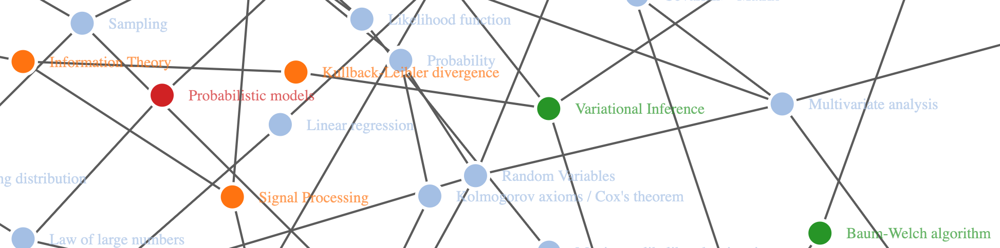

# Machine Learning Knowledge Graph

> *Work in progress*

Machine learning emerges from the intersection of many fields of study. Important
concepts in these areas are related in many ways. The aim with this graph is to 
highlight the connections between those concepts and, hopefully, help us navigate
this complex idea space.

The concepts were classified in 7 categories:

- Mathematics
- Statistics
- Information Theory
- Machine Learning
- Optimization
- Computer Science
- Artificial Intelligence

A category called "Other" was added to list important related research areas. 
Some concepts lie on the intersection of fields and are hard to classify. An 
effort was made to put them where they are used more frequently. Besides the **[interactive graph](https://leandromineti.github.io/ml-knowledge-graph/)**, this repository contains a list of those concepts organized as a syllabus and indicates some **free**
online resources covering the subjects.

## Curriculum 

- Mathematics
  - Logic
    - Gödel's incompleteness theorems
  - Set theory
    - Empty set
    - Finite and infinite sets
    - Operations on sets
      - Complement
      - Union
      - Intersection
  - Algebra
    - Linear Algebra
      - Matrix transformation
      - Eigenstuff
      - Matrix decomposition
        - Singular Value Decomposition
        - Non-negative Matrix Factorization
    - Abstract Algebra
  - Calculus
    - Limits
    - Derivatives
      - Partial derivatives
        - Gradient
    - Integrals
    - Taylor series
      - Maclaurin series
    - Fourrier series
      - Fourrier transform
        - Laplace transform
  - Graph theory
  - Geometry
  - Topology
    - Algebraic topology
      - Manifolds
- Optimization
  - Iterative methods
    - Newton's method
    - Gradient descent
    - Expectation Maximization
      - Baum-Welch algorithm
  - Heuristics
    - Evolutionary algorithms
- Measure theory
  - Sigma-algebra
- Probability
  - Sample Space
  - Kolmogorov axioms
  - Cox's theorem
  - Relative frequency and probability
  - Counting methods
    - Multiplication rule
    - Permutation
    - Combination and Binomial coefficient
    - Arrangement
  - Conditional probability
  - Bayes' Theorem
    - Posterior probability distribution
  - Random Variables
    - Algebra of random variables
    - Expected value
    - Variance
    - Distributions
      - Exponential family
        - Normal distribution
        - Bernoulli distribution
      - Moment-generating function
        - Characteristic function
      - Multivariate distributions
        - Joint distribution
        - Marginal distribution
        - Conditional distribution
  - Probability inequalities
    - Chebyshev's inequality
    - Bernstein inequalities
      - Chernoff bound
      - Hoeffding's inequality
- Statistics
  - Sampling distribution
  - Law of large numbers
  - Central Limit Theorem
  - Resampling
    - Jacknife
    - Bootstrap
  - Monte Carlo method
  - Likelihood function
  - Random Field
    - Stochastic process
        - Time-series analysis
    - Markov Chain
  - Inference
    - Hypothesis testing
      - ANOVA
    - Survival analysis
      - Non-parametric
        - Kaplan–Meier
        - Nelson-Aalen
      - Parametric
        - Cox regression
    - Properties of estimators
      - Quantified properties
        - Error
          - Mean squared error
        - Bias and Variance
          - Unbiased estimator
            - Minimum-variance unbiased estimator (MVUE)
            - Cramér-Rao bound
        - Bias-variance tradeoff
      - Behavioral properties
        - Asymptotic properties
          - Asymptotic normality
          - Consistency
          - Efficiency
        - Robustness
          - M-estimators
    - Multivariate analysis
      - Covariance matrix
      - Dimensionality reduction
        - Feature selection
          - Filter methods
          - Wrapper methods
          - Embedded methods
        - Feature extraction
          - Linear
            - Principal Component Analysis
            - Linear Discriminant Analysis
          - Nonlinear
            - t-SNE
            - UMAP
      - Factor Analysis
    - Mixture models
      - Method of moments
      - Spectral method
    - Parametric inference
      - Regression
        - Linear regression
        - Quantile regression
        - Autoregressive models
        - Generalized Linear Models
          - Logistic regression
          - Multinomial regression
    - Bayesian Inference
      - Maximum a posteriori estimation
      - MCMC
        - Hamiltonian Monte Carlo
      - Variational inference
    - Probabilistic Graphical Models
      - Bayesian Networks
        - Hidden Markov Models
          - Maximum-entropy Markov model
      - Markov Random Field
        - Boltzmann machine
      - Latent Dirichlet Allocation
      - Conditional Random Field
    - Nonparametric inference
      - Additive models
        - Generalized additive models
      - Kernel density estimation
    - Generative and discriminative models
- Machine Learning
  - Statistical Learning Theory
    - Vapnik-Chervonenkis theory
    - Hypothesis set
      - No free lunch theorem 
    - Loss function
    - Regularization
      - LASSO
      - Ridge
      - Elastic Net
      - Early stopping
      - Dropout
  - Cross-validation
    - Hyperparameter optimization
    - Automated Machine Learning
  - k-NN
  - Naive Bayes
  - Support Vector Machines
    - Kernel trick
  - Decision trees
    - Random Forest
  - Neural Networks
    - Training
      - Backpropagation
      - Activation function
        - Sigmoid
        - Softmax
        - Tanh
        - ReLU
    - Architecture
      - Feedforward networks
        - Perceptron
        - Multilayer perceptron
          - Convolutional Neural Networks
            - Deep Q-Learning
            - Temporal Convolutional Networks
        - Autoencoder
          - Variational autoencoder
      - Recurrent networks
        - LSTM
        - Hopfield networks
        - Gated Recurrent Unit
        - Neural Turing Machine
        - Attention mechanism
      - Restricted Boltzmann machine
        - Deep Belief Network
      - Graph Neural Networks
  - Adversarial Machine Learning
    - Generative Adversarial Networks
  - Ensemble
    - Bagging
    - Boosting
    - Stacking
  - Meta-learning
  - Sequence models
- Information Theory
  - Entropy
    - Maximum entropy models
  - Kullback–Leibler divergence
  - Signal processing
    - Kalman filter
- Computer Science
  - Algorithms
    - Computability
      - Church–Turing thesis
    - Complexity
- Artificial Intelligence
  - Decision Theory
    - Utility function
  - Game Theory
    - Zero-sum game
      - Minimax
  - Cybernetics
    - Control theory
  - Symbolic AI
    - Logic-based
  - Natural Language Processing
    - Natural Languange Understanding
      - Speech recognition
    - Information Retrieval
      - Set-theoretic models
        - Standard Boolean model
        - Extended Boolean model
        - Fuzzy retrieval
      - Algebraic models
      - Probabilistic models
    - Turing test
- Other
  - Cognitive sciences
  - Econometrics
  - Jurimetrics
  - Statistical physics
    - Hamiltonian mechanics
    - Ising model

## **Free** resources and references

### Mathematics

- Tool: [Khan Academy](https://www.khanacademy.org/)

#### Linear Algebra

- Playlist: [Essence of Linear Algebra by 3blue1brown](https://www.youtube.com/watch?v=fNk_zzaMoSs&list=PLZHQObOWTQDPD3MizzM2xVFitgF8hE_ab)
- Playlist: [MIT 18.06 - Linear Algebra](https://www.youtube.com/watch?v=ZK3O402wf1c&list=PLE7DDD91010BC51F8)
- Course: [Computational Linear Algebra](https://www.fast.ai/2017/07/17/num-lin-alg/)

#### Calculus

- Article: [The Matrix Calculus you need for Deep Learning](https://arxiv.org/pdf/1802.01528.pdf)
- Playlist: [Essence of Calculus by 3blue1brown](https://www.youtube.com/watch?v=WUvTyaaNkzM&list=PLZHQObOWTQDMsr9K-rj53DwVRMYO3t5Yr)

### Statistics

- Tool: [Seeing Theory](https://seeing-theory.brown.edu/)

#### Uncertainty and hypothesis testing

- Article: [The hacker's guide to uncertainty](https://erikbern.com/2018/10/08/the-hackers-guide-to-uncertainty-estimates.html)
- Article: [There is only one test!](http://allendowney.blogspot.com/2011/05/there-is-only-one-test.html)
- Article: [There is still only one test](http://allendowney.blogspot.com/2016/06/there-is-still-only-one-test.html)

#### Bayesian inference

- Article: [Frequentism and Bayesianism: A Practical Introduction](http://jakevdp.github.io/blog/2014/03/11/frequentism-and-bayesianism-a-practical-intro/)
- Article: [Towards A Principled Bayesian Workflow](https://betanalpha.github.io/assets/case_studies/principled_bayesian_workflow.html)

#### Generative vs. Discriminative models

- Article: [On Discriminative vs. Generative classifiers: A comparison of logistic regression and naive Bayes](http://ai.stanford.edu/~ang/papers/nips01-discriminativegenerative.pdf)
- Article: [Generative and discriminative classifiers: Naive Bayes and Logistic Regression](http://www.cs.cmu.edu/~tom/mlbook/NBayesLogReg.pdf)
- Post: [Generative vs. Discriminative; Bayesian vs. Frequentist](https://lingpipe-blog.com/2013/04/12/generative-vs-discriminative-bayesian-vs-frequentist/)

#### Survival Analysis

- Article: [Machine Learning for Survival Analysis: A Survey](http://dmkd.cs.vt.edu/papers/CSUR18.pdf)

### Information Theory

- Article: [Visual Information Theory](https://colah.github.io/posts/2015-09-Visual-Information/)

### Machine Learning

- Article: [Statistical Modeling: the two cultures](http://www2.math.uu.se/~thulin/mm/breiman.pdf)
- Article: [A visual introduction to machine learning](http://www.r2d3.us/visual-intro-to-machine-learning-part-1/)
- Article: [Model tuning and the Bias-Variance tradeoff](http://www.r2d3.us/visual-intro-to-machine-learning-part-2/)
- Tool: [Arxiv Sanity Preserver](http://www.arxiv-sanity.com/)
- Tool: [Google Colaboratory](https://colab.research.google.com)
- Tool: [Kaggle](https://www.kaggle.com/)
- Tool: [Seedbank: Collection of Interactive Machine Learning Examples](https://research.google.com/seedbank/)
- Course: [Google Machine Learning Crash Course](https://developers.google.com/machine-learning/crash-course/)
- Course: [Machine Learning for Coders](https://course.fast.ai/ml)
- Book: [An Introduction to Statistical Learning](https://www-bcf.usc.edu/~gareth/ISL/ISLR%20Seventh%20Printing.pdf)
- Book: [The Elements of Statistical Learning](https://web.stanford.edu/~hastie/ElemStatLearn/printings/ESLII_print12.pdf)
- Journal: [Distill](https://distill.pub/)
- Blog: [Explained.ai](https://explained.ai/)

#### Statistical Learning Theory

- Playlist: [Caltech CS 156 - Learning from data](https://www.youtube.com/watch?v=mbyG85GZ0PI&list=PLD63A284B7615313A)

#### Neural Networks and Deep Learning

- Article: [A Comprehensive Survey on Graph Neural Networks](https://arxiv.org/abs/1901.00596v1)
- Playlist: [Neural Networks by 3blue1brown](https://www.youtube.com/watch?v=aircAruvnKk&list=PLZHQObOWTQDNU6R1_67000Dx_ZCJB-3pi)
- Repository: [MIT Deep Learning](https://github.com/lexfridman/mit-deep-learning)
- Tool: [A Neural Network Playground](https://playground.tensorflow.org/#activation=tanh&batchSize=10&dataset=circle&regDataset=reg-plane&learningRate=0.03&regularizationRate=0&noise=0&networkShape=4,2&seed=0.54960&showTestData=false&discretize=false&percTrainData=50&x=true&y=true&xTimesY=false&xSquared=false&ySquared=false&cosX=false&sinX=false&cosY=false&sinY=false&collectStats=false&problem=classification&initZero=false&hideText=false)
- Course: [Deep Learning for Coders](https://course.fast.ai/index.html)
- Course: [Deep Learning for Coders 2](https://course.fast.ai/part2.html)
- Course: [MIT Deep Learning](https://deeplearning.mit.edu/)
- Book: [Neural Networks and Deep Learning](http://neuralnetworksanddeeplearning.com/)
- Book: [Deep Learning](https://www.deeplearningbook.org/)
- Reading list: [Deep Learning Papers Reading Roadmap](https://github.com/floodsung/Deep-Learning-Papers-Reading-Roadmap)

#### Ensemble

- Article: [Kaggle Ensembling Guide](https://mlwave.com/kaggle-ensembling-guide/)

#### Time Series

- Book: [Forecasting: Principles and Practice](https://otexts.org/fpp2/)

### Optimization

- Article: [How optimization for machine learning works](https://brohrer.github.io/how_optimization_works_1.html)
- Article: [Learning to Optimize with Reinforcement Learning](https://bair.berkeley.edu/blog/2017/09/12/learning-to-optimize-with-rl/)
- Blog: [Off The Convex Path](http://www.offconvex.org/)

### Artificial Intelligence

- Course: [Text as Data](https://cbail.github.io/textasdata/Text_as_Data.html)

## Contributing

Usually, I search through many sources to look for interesting concept relations. For example, when adding a new node it is useful to see what comes up at [wikidata](https://www.wikidata.org/wiki/Wikidata:Main_Page) and [metacademy](https://metacademy.org). If you want to contribute, please open an issue stating the following:

- Concept category.
- Concept name.
- Which other concepts should it be linked to.
- References.

## FAQ

- **Why make a distinction between Machine Learning and Artificial Intelligence?**

I followed the approach explored by Russel and Norvig [1]. In that sense, Artificial
Intelligence is a broader field that encompasses Machine Learning. 

## References

[1] Russell, S. J., & Norvig, P. (2016). Artificial intelligence: a modern approach. Malaysia; Pearson Education Limited,.
